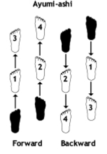
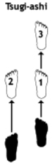
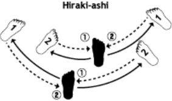
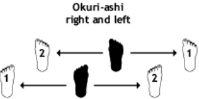
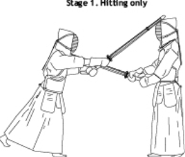
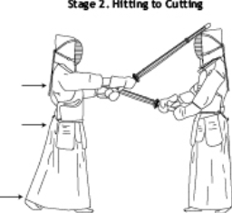

# Movimento Dos Pés

## Introdução

Neste capítulo, apresentarei minhas ideias sobre ashi-sabaki (movimento dos pés) e cortes. Esses são os primeiros conceitos que os iniciantes aprendem e são elementos essenciais até mesmo para os praticantes experientes continuarem praticando.

## Ashi-Sabaki

Existem quatro tipos básicos de ashi-sabaki no kendo. Eles são chamados de ayumi-ashi, okuri-ashi, hiraki-ashi e tsugi-ashi (veja a Figura 1). Em primeiro lugar, é importante que o instrutor forneça uma imagem clara de como dominar o movimento dos pés está intrinsecamente ligado a aspectos mais avançados do treinamento, como waza-geiko (prática de técnicas), ji-geiko (*sparring*) e shiai (competições). Os instrutores devem demonstrar claramente os vários movimentos e fazer com que seus alunos compreendam a relação entre cada tipo de movimento dos pés e as circunstâncias em que cada um é empregado.

Figura 1

## O Problema

Após perceber a importância fundamental do movimento dos pés, os próximos passos são entender qual pé deve ser usado como fonte de potência e reconhecer a função específica de cada pé. Isso é especialmente relevante ao praticar okuri-ashi, que está intimamente relacionado a fumikiri e fumikomi, os quais serão introduzidos em um capítulo posterior.

As pessoas tendem a seguir dois padrões fixos ao praticar okuri-ashi. O primeiro é “ichi” (movimentar o pé direito para frente), “ni” (puxar o pé esquerdo para cima), “san” (movimentar o pé esquerdo para trás), “shi” (puxar o pé direito para trás). O segundo é “ichi” (movimentar o pé direito para frente e puxar o pé esquerdo para cima), “ni” (movimentar o pé esquerdo para trás e puxar o pé direito para trás). Como resultado da prática desses dois padrões, um problema comum é que o pé esquerdo tende a ficar para trás.

Esse problema se torna mais óbvio quando passos contínuos são conectados, por exemplo, ao fazer okuri-ashi de um lado do dojo para o outro. Não é necessário dizer que o problema é acentuado com a introdução de fumikomi. Nesse caso, o lado esquerdo do corpo fica para trás, e o praticante acaba avançando, mas a direção que o corpo está enfrentando se torna diagonal. A combinação do pé esquerdo atrasado e da postura diagonal resulta em um movimento abrupto. Esse problema infeliz é resultado de praticantes que simplesmente observam e imitam o movimento dos outros.

É difícil entender como alguém está conseguindo o movimento deslizante suave apenas observando. Se o praticante compreender claramente qual pé está sendo usado para se impulsionar e de onde vem a força, ele poderá executar o okuri-ashi corretamente. A seguir, apresento uma maneira de resolver esse problema.

## Uma Solução

Vamos reexaminar a função dos pés direito e esquerdo. Pensar que okuri-ashi é apenas "mover o pé direito para frente e depois puxar o pé esquerdo" não é suficiente. Ao avançar com okuri-ashi, os praticantes devem entender que o pé direito se move porque a perna esquerda está fazendo o impulso. Ao puxar o pé esquerdo, é a perna direita que está fazendo a tração. Da mesma forma, quando a perna esquerda empurra, o pé direito se move para frente. Quando a perna direita puxa, o pé esquerdo é puxado para cima.

Para descrever esse processo em detalhes: 1) empurre o chão com a perna esquerda (como resultado, o pé direito se move para frente); 2) endireite a perna direita (como resultado, o pé esquerdo é puxado para frente); 3) após o segundo passo, imediatamente empurre o chão com a perna esquerda e repita o processo novamente.

O movimento do pé esquerdo melhorará se o praticante entender a função de cada pé dessa maneira. Primeiro, é melhor começar com movimentos grandes e lentos. A cabeça irá balançar para cima e para baixo, mas isso não é um problema. À medida que o movimento se torna mais suave e menor, isso se corrigirá. Se houver foco excessivo em manter a cabeça sem se mover para cima e para baixo neste estágio, o movimento ficará brusco. Se você já patinou no gelo, terá experimentado uma situação em que o pé que lidera é empurrado para frente pela força da perna que fica atrás. Okuri-ashi segue o mesmo princípio.

Os detalhes serão explicados mais adiante, mas tenha em mente que esse princípio está intimamente relacionado a dominar fumikiri e fumikomi. Essa forma de pensar sobre o movimento dos pés precisa ser introduzida nos estágios iniciais do kendo para servir como base para uma prática mais avançada.

O próximo ponto a ser considerado é incentivar a prática de ashi-sabaki enquanto interage com um parceiro. É mais divertido e realista para os alunos se dividirem em pares e focarem no distanciamento, na altura do shinai e no metsuke (olhar), do que apenas ter o instrutor na frente deles. Por exemplo, duas pessoas de frente uma para a outra podem verificar seu chuudan-no-kamae (postura, posição, altura do shinai, etc.). Eles então decidem quem se move primeiro (lado A) e quem segue (lado B). Quando A dá um passo à frente, B dá um passo para trás. Quando A dá um passo para a direita, B dá um passo para a esquerda. Ambos os lados, especialmente o lado B, devem tentar manter a mesma distância entre si (maai). Assim, os praticantes começam dando um passo para frente, para trás, direita ou esquerda, e depois aumentam gradualmente o número de passos.

Também é importante que os professores aproveitem essa oportunidade para fazer os alunos entenderem a importância de manter o en durante o keiko. En é a conexão mental e a relação entre você e seu parceiro durante o treino. Manter o en é um requisito fundamental, e cabe ao professor garantir que os alunos compreendam isso. Está intimamente relacionado a entender e praticar kentai-itchi, que será introduzido mais tarde.

Em seguida, os alunos devem ser incentivados a dar passos diagonais também. Isso é seguido pelo próximo estágio, no qual eles podem se mover livremente em qualquer direção e dar quantos passos quiserem. Neste ponto, ambos os lados são incentivados a usar não apenas okuri-ashi, mas também outros tipos de movimento dos pés, como ayumi-ashi, hiraki-ashi e tsugi-ashi, mantendo os joelhos ligeiramente dobrados e a postura ereta para dominar um ashi-sabaki suave e sem esforço. Na etapa final desta prática, A tenta manter o controle do chuushin (o centro) e quebrar o chuushin de B usando as técnicas harai, osae e maki quando o maai ficar muito próximo. Um dos principais objetivos deste exercício é não apenas dominar o okuri-ashi avançando, mas também outros ashi-sabaki para movimentação em todas as direções.

Na maior parte, no waza-geiko, tendemos a nos mover para frente e para trás, especialmente para frente, usando okuri-ashi. No entanto, se esse for o limite do repertório de movimentos dos pés de uma pessoa, sua capacidade de se mover em várias direções durante o ji-geiko ou shiai será severamente limitada. Assim, o objetivo de praticar o movimento dos pés com um parceiro é adquirir uma movimentação corporal suave utilizando todos os tipos de movimento dos pés em todas as direções, além de incentivar um tenouchi (pegada no shinai) relaxado, mas firme, manter a postura correta o tempo todo e controlar o centro.

## Corte

No kendo, somos requisitados a “cortar” com o shinai, e não simplesmente “tocar” ou “golpear”. Claro, isso deve ser interpretado como um ideal, e não de forma literal. Consideramos nosso shinai como uma espada e tentamos golpear com ênfase no hasuji correto (golpear com o fio da lâmina), com a sensação de tentar “cortar” nosso alvo. Dito isso, eu realmente não seria capaz de fornecer uma resposta específica se me perguntassem: “Então, o que é um golpe que corta e o que não é?” No kendo, se um golpe é executado com o tempo apropriado, aproveitando uma abertura clara, devemos ter a sensação de ter feito um bom corte ou de ter sido cortado, mesmo que o ataque seja leve.

Por outro lado, se o ataque é feito aleatoriamente, quando a oportunidade de golpe não está clara, tendemos a não reconhecê-lo como um bom corte, mesmo que seja um golpe forte. À medida que desenvolvemos nossas habilidades e compreensão do kendo, aprendemos a compartilhar o mesmo sentimento de “cortar” ou ser “cortado” com várias pessoas. Isso exige muita experiência de keiko e leva tempo, mas continuar treinando arduamente é o único caminho para alcançar esse entendimento. Com isso em mente, gostaria de apresentar uma ideia que ajuda os iniciantes a entender e praticar suburi e o golpe real com boa postura, em conexão com o ashi-sabaki e a ideia de fazer um “bom corte”.

Imagine que há um oponente na sua frente enquanto você faz os balanços de prática no suburi, e tente “cortar” esse oponente. Você deve transferir a força das costas para os cotovelos, dos cotovelos para os pulsos e, em seguida, para o shinai. Não apenas balance o shinai para cima e para baixo sem propósito. Sempre traga o pé esquerdo para frente sem deixá-lo ficar para trás, lembrando que a fonte de força para esse movimento rápido é o endireitamento da perna direita. Hikitsuke ocorre logo após o golpe e o estalo do pé (fumikomi). Sem o hikitsuke, a ação de “cortar” não pode ser completada. A Figura 2 ilustra essa ideia de forma esquemática.

O hikitsuke também permite a prontidão para o próximo movimento. O Estágio 1 mostra o golpe no oponente. A ação de “cortar” é concluída após o pé esquerdo ser trazido para frente, e a postura é estabilizada, como demonstrado no Estágio 2. Pode ser mais fácil entender se você imaginar como uma faca é usada para cortar pão; você não consegue cortar empurrando para baixo a partir do topo. Você precisa fatiar. Trazer o pé esquerdo para frente, como no Estágio 2, completa essa ação de “cortar” no kendo. Essa pode não ser a maneira mais adequada de explicar o corte, mas fornecerá aos iniciantes uma oportunidade de compreender a sensação de cortar e a relação entre ashi-sabaki e o golpe.

Figura 2

## Resumo

Neste capítulo, apresentei minhas ideias para a prática e o ensino do ashi-sabaki e da fundamental ação de corte. Não descrevi os aspectos técnicos de cada exercício em grande detalhe, pois minha intenção foi mostrar métodos de prática e ensino de movimentação e corte que estão interligados e também são relevantes para o keiko. No próximo capítulo, apresentarei maneiras de praticar e ensinar fumikomi e hikitsuke para pessoas que começam o kendo mais tarde na vida ou que têm problemas nos joelhos. Ambas as situações são frequentemente encontradas em países ocidentais. Além disso, oferecerei algumas sugestões sobre como manter a prática do kendo livre de lesões.
